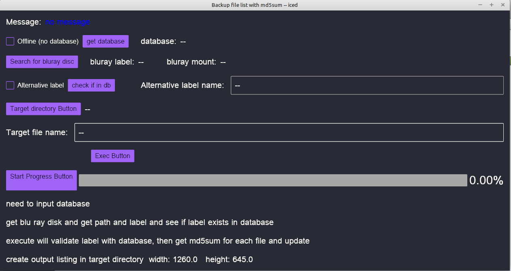

# bkmd5sum
Rust-Iced program: Reads a bluray or dvd disk and outputs a csv file with vertical bar separator and generates md5sum for each file

This program calls winitsize01 to get the smallest monitor size

